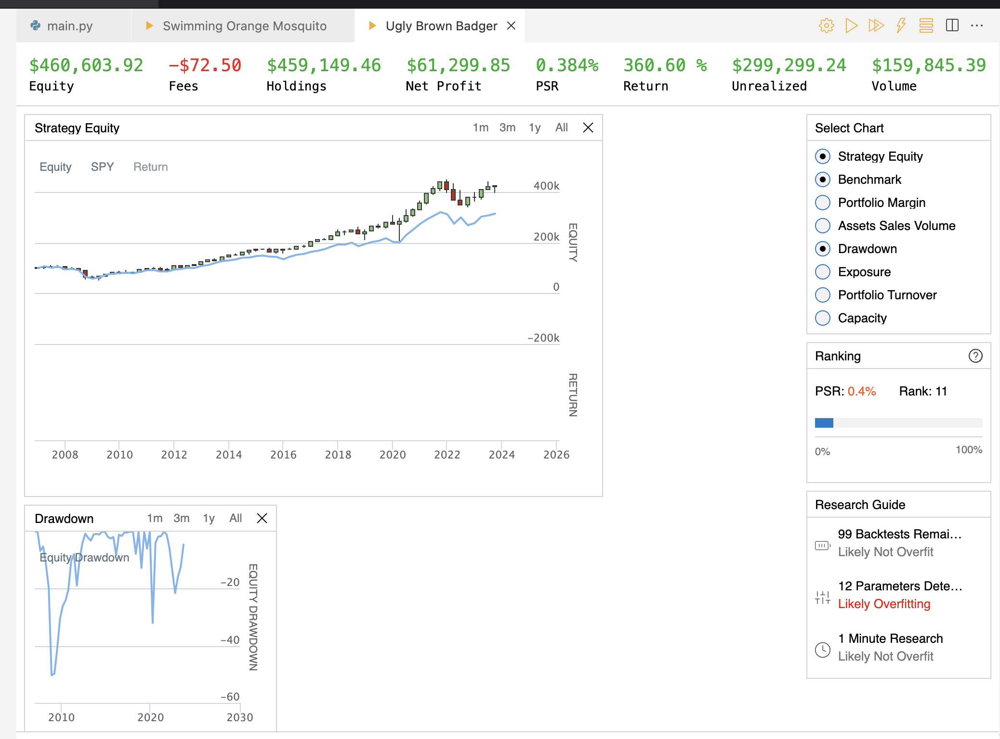
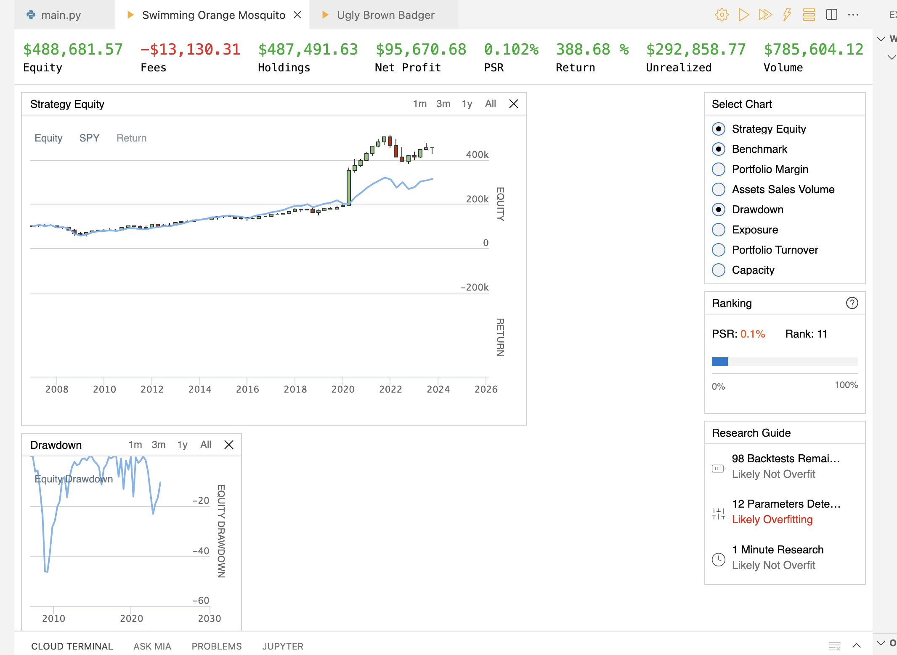

```{r setup, include=FALSE}
knitr::opts_chunk$set(echo = TRUE)
```

# Understanding Fat-Tailed Distributions

## Overview

Fat-tailed distributions are distributions that exhibit larger skewness and kurtosis than normal distributions. These distributions can be difficult to understand and predict. They may have undefined means and variances. Great care must be taken when working with data that might originate from a fat-tailed distribution, as typical methods of analysis may not be appropriate.

These distributions are often observed in nature and markets, and can have significant consequences for decision-making. In this report, I will explore the implications of fat-tailed distributions, and demonstrate how a better understanding of them can be used to improve outcomes in real world applications, like investing in financial markets.

## Software for Improved Understanding

I've put together an R package, `TailRiskAnalyzer` available at https://misikoff.github.io/TailRiskAnalyzer/. This package includes many functions for exploring the implications of fat tails. These functions range from the analytical to the demonstrative, and help users analyze distributions for "fat-tailedness" and understand the implications of "fat-tailedness". Listed below are a few functions from the package with brief descriptions:

- `p_normal_given_event`: calculate the relative odds of data coming from a normal distribution compared to a
distribution with heavier tails, e.g., Student's t-distribution, Pareto distribution, etc.
- `create_side_by_side_plot`: plot outcome distributions for different betting strategies, highlighting the difference between median outcome and expected value, and illustrating the differences between ensemble averages and time
averages
- `draw_lln_with_func_facet`: demonstrate the behavior of the sample mean taken from a provided distribution compared to a Normal distribution.

```{r, echo=FALSE,out.width="49%", out.height="20%",fig.cap="create\\_side\\_by\\_side\\_plot demonstrates the distribution of outcomes of a betting game based on sequential coin tosses (left) \n and draw\\_lln\\_with\\_func\\_facet demonstrates the behavior of the sample mean taken from a Cauchy distribution compared to a sample mean from a Normal distribution (right)",fig.show='hold',fig.align='center'}
knitr::include_graphics(c(
  "./images/TailRiskAnalyzer/side.png",
  "./images/TailRiskAnalyzer/cauchy.png"
))
```

These relatively simple functions can be helpful for developing better intuitions about distributions and their properties. For example in the second plot of Figure 1, the behavior of the sample mean from a Cauchy distribution is compared to a $\text{Normal(0,1)}$ distribution. While the $\text{Normal}(0, 1)$ converges quickly, the Cauchy distribution does not converge at all, as the Central Limit Theorem does not apply, given the Cauchy distribution's undefined mean and variance. In fact, the sample mean of a $\text{Cauchy}(0, 1)$ distribution is also a $\text{Cauchy}(0, 1)$. Graphs like this can be a helpful tool for understanding what this property means in practice.

# Real World Applications in Finance

Considerations for these distributions can be valuable in many real-world applications, like investing in the U.S. stock market. For example, the S&P 500 is one of the most popular stock market indices, containing the 500 largest listed stocks in the U.S. market, by market capitalization ($\text{stock price} * \text{outstanding shares}$). This index can be traded by investing in an exchange-traded fund (ETF), such as SPDR S&P 500 ETF Trust (SPY). The daily returns of SPY are fat-tailed, exhibiting a kurtosis much greater than that expected by data generated from a normal distribution. My analysis of the log of daily returns from January 29th, 1993 through March 1st, 2024, found the kurtosis to be greater than 14. The data for this analysis was gathered from Yahoo Finance.

```{r, echo=FALSE,out.width="49%", out.height="20%",fig.cap="A thin bell with longer tails demonstrates excess kurtosis in daily log returns",fig.show='hold',fig.align='center'}
knitr::include_graphics(c(
  "./images/finance/SPY-returns.png"
))
```

Investing in the S&P 500, via SPY, is a classic buy-and-hold strategy with a great historic record, but this strategy's risk profile may be improved through "insurance", in light of the excess kurtosis of the returns. In this case, the insurance we are seeking should have a predictable, fixed cost, and offset losses in SPY. Insuring this portfolio against catastrophic losses can be seen as a way to raise the median outcome in exchange for lowering the mean outcome through insurance premiums. Here the median and the mean can be far apart, due to the excess kurtosis. This could be a great exchange given we don't have the luxury of experiencing all potential paths for the portfolio and must be satisfied with the single path the index takes.

## Insurance Through Options

Buying options is a natural fit for insuring a portfolio, as they have fixed costs. A 'put' option gives the owner the right to sell a stock at a specified *strike price* at any time between the purchase of the contract and it's expiration, as opposed to a 'call' option which gives the owner the right to sell at a specified strike price. If we wish to offset losses from major downturns in a stock, we may purchase 'put' options that become increasingly profitable as the stock value drops.

### Anatomy of a Stock Option

- **Strike Price**: The price at which the option holder can buy or sell the stock.
- **Expiration Date**: The date at which the option contract expires.
- **Option Premium**: The price paid for the option contract.
- **In-the-Money**: A call option is in-the-money (or profitable) if the stock price is above the strike price. A put option is in-the-money if the stock price is below the strike price.
- **Out-of-the-Money**: A call option is out-of-the-money (or unprofitable) if the stock price is below the strike price. A put option is out-of-the-money if the stock price is above the strike price.
- **At-the-Money**: The stock price is equal to the strike price.
- **Payoff Profile**: The profit or loss of an option at expiration, given the stock price at that time.

```{r, echo=FALSE,out.width="49%", out.height="20%",fig.cap="Example Put Option Payoff Profile",fig.show='hold',fig.align='center'}
knitr::include_graphics(c(
  "./images/finance/puts-profile.png"
))
```

## Insuring a SPY Portfolio

The portfolio's primary position will be shares of SPY. The remainder of the portfolio will be invested in 'put' options which become profitable when large downturns in SPY occur, or are expected. These options expire over time, so the portfolio must be rebalanced periodically. For the specifics of handling the put options, I borrowed from hedge fund manager Mark Spitznagel writings, which suggested hedging against tail-risk through put options with a strike price 30% below current market value with expirations 60 days in the future. Every 30 days, these options will be sold and a new batch of options expiring in 60 days will be purchased.

### Summary of Insured SPY Strategy

Each month (on the third Friday):

- sell any held options
- rebalance portfolio between SPY and put options
  1. **95.5% SPY**
  2. **0.5% SPY put options** that are 30% below the current price (out-of-the-money), with expirations 60 days in the future

## Measuring Performance through Portfolio Statistics

### Beta

$\beta$ measures the variance of a portfolio's returns relative to the variance of the market. It is a limited, but popular proxy for risk. This variance is not only relevant in terms of outcomes, but also in terms of psychology, as intermittent fluctuations may be tough to for investors to bear.

$$
\begin{aligned}
\beta_p = \frac{\mathrm{Cov}(r_p,r_m)}{\mathrm{Var}(r_m)} \\
\end{aligned}
$$

- $\beta_p$	=	market beta of asset $p$

- $r_m$	=	average expected rate of return on the market

- $r_p$	=	expected return on portfolio $p$

### Treynor Ratio

The Treynor Ratio measures the excess returns (as compared to the risk-free rate of return), relative to the $\beta$ of the asset. This ratio can be seen as a simple score for an asset or portfolio, where higher numbers represent more favorable outcomes.

$$
\begin{aligned}
T_p = \frac{r_p-r_f}{\beta_p} \\
\end{aligned}
$$

- $r_p$	=	expected return on portfolio $p$

- $r_f$	=	risk-free rate of return

- $B_p$	=	beta of portfolio $p$

## Results

I implemented this strategy on QuantConnect's algorithmic trading platform to simulate it's performance. Results were simulated for January 1st, 2007 through January 1st 2024. This time period was selected based on the data available on the platform at the time. In the table below, the results of the "insured" strategy are compared to the "naive" buy-and-hold strategy.

| Strategy | Return (%) | $\beta_p$ | $T_p$
| :-------- | -------: | ---: | --: |
| SPY Buy-and-Hold | 360.60 | 0.996 | 0.062
| Insured SPY | 388.68 | 0.597 | 0.113

As the table above shows, the $beta$ of the insured strategy was significantly reduced. In this case, in a welcome surprise, the insurance itself also yielded a positive return thanks to the shock of the COVID pandemic, which increased concern for a market crash, creating a huge payoff for the strategy's put options in March of 2020.

These two factors equate to an improvement in the Treynor Ratio of about 82% over the naive "SPY Buy-and-Hold" strategy.

```{r, echo=FALSE,out.width="49%", out.height="20%",fig.cap="SPY Buy-and-Hold (left) vs. Insured SPY (right) performance",fig.show='hold',fig.align='center'}
knitr::include_graphics(c(
  "./images/finance/QuantConnect/naive-equity.png",
  "./images/finance/QuantConnect/insured-equity.png"
))
```

# Conclusion

As demonstrated above, the consequences of fat-tailed distributions can be both surprising and significant. Through the use of software tools like `TailRiskAnalyzer`, a better understanding of these distributions can be built. This understanding can be applied to a wide range of important applications, like adjusting payoff profiles in financial markets to better suite the the goals of investors.

\newpage

# References

- Nassim Nicholas Taleb. (2020). Statistical Consequences of Fat Tails: Real World Preasymptotics, Epistemology, and Applications. Stem Academic Press.
- Mandelbrot, B. B., & Hudson, R. L. (2010). The (Mis)Behaviour of markets. Profile Books.
- Maclean, L. C., Thorp, E. O., & Ziemba, W. T. (2011). The Kelly capital growth investment criterion : theory and practice. World Scientific.
- Ole Peters. (2011). Optimal leverage from non-ergodicity, Quantitative Finance, 11:11, 1593-1602, DOI: 10.1080/14697688.2010.513338
- Ole Peters. (2019). The Ergodicity problem in economics. Nat. Phys. 15, 1216-1221. https://doi.org/10.1038/s41567-019-0732-0
- Ole Peters and Alexander Adamou. (2021). The Time interpretation of expected utility theory. arXiv.org
- Spitznagel, M. (2013). The Dao of capital : Austrian investing in a distorted world. Wiley.
- Spitznagel, M., & Taleb, N. N. (2021). Safe haven: investing for financial storms. Wiley.

\newpage

# Appendix

All code for this report is available on the GitHub repository for this report: https://github.com/misikoff/STA583-Portfolio/.

The repository for the package `TailRiskAnalyzer` can be found at https://github.com/misikoff/TailRiskAnalyzer/.
The documentation website is available at https://misikoff.github.io/TailRiskAnalyzer/.

For more about QuantConnect's algorithmic trading platform, visit https://www.quantconnect.com/.

## QuantConnect Algorithm

Parameter Settings:

- option_weight: 0.005
- equity: "SPY"
- OOM: 0.3

```python
from AlgorithmImports import *

class LogicalLightBrownWhale(QCAlgorithm):
    def Initialize(self):
        self.SetStartDate(2007, 1, 1)
        self.SetEndDate(2024, 1, 1)

        self.initCash = 100000
        self.SetCash(self.initCash)

        # Benchmark
        self.MKT = self.AddEquity(self.GetParameter("equity"), Resolution.Daily).Symbol
        self.mkt = []

        option = self.AddOption(self.GetParameter("equity"), Resolution.Daily)
        option.SetFilter(minExpiry = timedelta(50), maxExpiry = timedelta(70))
        self.symbol = option.Symbol
        
        self.friday_count = 0

        # reset the Friday counter each month
        self.Schedule.On(self.DateRules.MonthStart(self.symbol),  
                            self.TimeRules.AfterMarketOpen(self.symbol, 0),
                            self.OnNewMonth)
        
        # Schedule the monthly rebalancing
        self.Schedule.On(self.DateRules.WeekEnd(),  
                            self.TimeRules.AfterMarketOpen(self.symbol, 0),
                            self.Rebalance)

    def OnData(self, data):
        self.data = data

    def OnNewMonth(self):
        self.friday_count = 0
            
    def Rebalance(self):
        self.friday_count += 1

        if not self.friday_count == 3: return
        if not hasattr(self, "data"): return

        self.updateBenchmark()
        
        self.Log(f"Rebalancing")

        for symbol in self.getHeldOptionsSymbols():
            self.Liquidate(symbol)
        
        chain = self.data.OptionChains.get(self.symbol)
        if not chain: 
            self.SetHoldings([PortfolioTarget(self.GetParameter("equity"), 1)])
            return
        
        # filter for put contracts
        contracts = [x for x in chain if x.Right == OptionRight.Put]
        # filter for contracts far enough OOM
        contracts = [x for x in contracts if x.Strike < 
            float(1 - float(self.GetParameter("OOM"))) * x.UnderlyingLastPrice]
        # filter for contracts expiring in 2 months    
        contracts = [x for x in contracts if (x.Expiry - self.data.Time).days > 50]

        self.Log(f"Current {self.GetParameter("equity")}: "
                 f"{self.Securities[self.GetParameter("equity")].Price}")

        contracts = sorted(contracts, key = lambda x: x.Strike, reverse = True)

        if len(contracts) > 0:
            selected_contract = contracts[0]
            self.Log(f"buying put option with strike: ${selected_contract.Strike}, "
                     f"expiring: {selected_contract.Expiry.date()}")
            self.SetHoldings([PortfolioTarget(
                self.GetParameter("equity"),
                 1 - float(self.GetParameter("option_weight"))),
                 PortfolioTarget(selected_contract.Symbol,
                 float(self.GetParameter("option_weight")))])
        else:
            self.SetHoldings([PortfolioTarget(self.GetParameter("equity"), 1)])

    def updateBenchmark(self):
        mkt_price = self.History(self.MKT,
                                 2,
                                 Resolution.Daily)["close"].unstack(level= 0).iloc[-1]
        self.mkt.append(mkt_price)

        # Does not handle any stock splits that occur
        mkt_perf = self.initCash * self.mkt[-1] / self.mkt[0] 
        self.Plot("Strategy Equity", self.MKT, mkt_perf)

    def OnEndOfAlgorithm(self):
        self.Log("is working the end of algo function")
        self.updateBenchmark()

    def getHeldOptionsSymbols(self):
        option_symbol_list = []
        invested = [x.Symbol for x in self.Portfolio.Values if x.Invested]
        for symbol in invested:
            if symbol.SecurityType == SecurityType.Option:
                option_symbol_list.append(symbol)
    
        return option_symbol_list
```

### Additional QuantConnect Images




